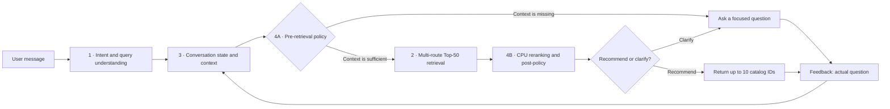

# Shopping Copilot — Stateful Conversational Product Search

> An offline shopping agent that remembers changing requirements, knows when to ask a useful question, and searches a frozen catalog of 50,000 products on CPU.

**TikTok TechJam 2026 · Track 4 · Official entry: `from agent import Agent`**

[Run locally](#run-it-locally) · [Read the technical report](docs/submission/TECHNICAL_REPORT.md) · [View the Devpost story](docs/submission/DEVPOST_ABOUT_PROJECT.md) · [Read in Chinese](README_ZH.md) · [Record a demo](#record-a-demo)

> **Public demo video:** the recorded walkthrough is ready locally; add the public YouTube URL here before final submission. Its narration and upload description are in [the video materials](docs/submission/YOUTUBE_DESCRIPTION.md).

## Why Shopping Copilot

A shopper's intent can change faster than a search form can capture it: *“black dress under $50”* can become *“blue instead,”* then *“no budget limit,”* then *“actually, shoes.”* Treating every message as a fresh query loses context; retaining every old preference creates stale constraints.

Shopping Copilot makes that decision process explicit. It distinguishes buying from browsing, turns language into structured state operations, carries forward only valid requirements, and chooses between clarification and recommendation based on both current context and retrieval feedback.

## Public development results

All results below use the **unchanged organizer evaluator**, the frozen 50,000-product catalog, and all **200 public development sessions**.

| Hit@10 | MRR | MTTC | Efficiency | TechnicalScore |
|---:|---:|---:|---:|---:|
| **98.5% (197/200)** | **0.888375** | **3.205** | **0.779500** | **0.914913** |

These are public development-set results, not private-test claims or the overall event score. Compared with the earlier fixed-two-question ranking baseline, the integrated agent preserves Hit@10 and MTTC while improving MRR from `0.884625` to `0.888375`.

## How one request flows through the agent



The submitted profile collects two pieces of evidence before the first retrieval. From turn three onward, the post-retrieval policy is dynamic: candidate quality and user feedback decide whether to recommend or ask one additional question. State updates are versioned, so stale or cross-session handoffs are rejected.

## A real five-turn walkthrough

Run this exact scenario with `python -m submission_tools.demo --scenario dynamic4b --pause`.

| Turn | Shopper message | State / policy decision | Result |
|---:|---|---|---|
| 1 | “I'm looking for Basketball Men, but I'm still exploring.” | 4A collects category evidence | Ask a focused follow-up; retrieval is skipped |
| 2 | “I want breathable mesh.” | 4A collects a preference | Ask a second follow-up; retrieval is skipped |
| 3 | “Prefer blue and under $60.” | State contains category, feature, color, and budget | Retrieve 50 candidates, rerank, recommend Top-10 |
| 4 | “Those options are not quite right yet.” | 4B detects negative feedback | Ask which feature would improve the match |
| 5 | “I want a drawstring closure.” | State adds the new feature and decays older soft preferences | Retrieve, rerank, and recommend again |

This demonstrates the core distinction in our design: 4A prevents premature retrieval, while 4B responds to evidence from an actual candidate pool.

## What is in the submitted agent

The active, reproducible configuration is intentionally lightweight:

- **Intent and state:** explicit set, clear, exclude, and remove-exclusion operations; hard constraints, decaying soft preferences, weak profile hints, asked-question history, and shown-product feedback.
- **Retrieval:** SQLite FTS5/BM25 keyword and category routes plus catalog evidence; a deterministic, recall-compatible Top-50 boundary.
- **Ranking and policy:** locked CPU reciprocal-rank features; at most ten returned IDs; one bounded retry never relaxes hard constraints.
- **Runtime:** Python standard library and SQLite FTS5 only. No GPU, model weights, Dense embeddings, Qwen/LLM inference, paid API, credentials, or external vector database are used by the official entry.

Research code for stricter adaptive retrieval and model-assisted experiments is kept separate from the submitted default and is not presented as an active dependency.

## Run it locally

Reference interpreter: **CPython 3.12.13**. Python 3.10+ and SQLite with FTS5 are required. There are no third-party Python packages to install.

```bash
python3 -m venv .venv
# macOS / Linux:
source .venv/bin/activate
# Windows PowerShell: .venv\Scripts\Activate.ps1

python -m pip install -r requirements.txt
python -m submission_tools.verify --code-only
python -m submission_tools.prepare_data
python -m submission_tools.verify
python -m submission_tools.evaluate --offline-check
```

`prepare_data` downloads the public organizer kit, verifies its pinned SHA-256, and installs it under `competition_kit/`. The source repository and submission ZIP deliberately exclude catalog data, labels, model weights, private sessions, caches, and credentials.

If automatic download is unavailable, download `techjam-participant-kit.zip` from the [official release](https://github.com/TechJam2026/techjam-conversational-search/releases/tag/participant-kit), then run:

```bash
python -m submission_tools.prepare_data --archive /path/to/techjam-participant-kit.zip
```

After setup, the official entry runs offline. The evaluator command blocks socket and DNS access in that process.

### Use the official API

```python
from agent import Agent

agent = Agent()
agent.reset("example", {
    "purchase_frequency": "unspecified",
    "average_prior_rating": None,
    "rating_style": "unspecified",
    "preference_tags": ["comfort"],
    "summary": "Comfort is a weak preference.",
})
response = agent.respond("example", "I need a black dress under $50.", 1, 10)
```

Each response contains `message`, `ask_attribute`, ordered `recommendations` with `parent_asin` values, and nonnegative `usage`. The Agent enforces sequential turn order and the ten-turn maximum. Judge-provided catalogs can be supplied with `Agent(catalog_path=...)` or `SHOPPING_CATALOG_PATH`.

## Record a demo

```bash
python -m submission_tools.demo --scenario clarify --pause
python -m submission_tools.demo --scenario override --pause
python -m submission_tools.demo --scenario browse --pause
python -m submission_tools.demo --scenario dynamic4b --pause
```

The terminal trace shows the user message, structured state, 4A decision, retrieval count, 4B decision, response, and feedback. For public recording, add `--delay 4 --ids-only` to hide product titles. See the [Chinese recording plan](docs/submission/YOUTUBE_PLAN_ZH.md), [English upload description](docs/submission/YOUTUBE_DESCRIPTION.md), and [narration script](docs/submission/VIDEO_NARRATION_EN.txt).

## Repository map

| Location | Responsibility | Start here |
|---|---|---|
| [`agent.py`](agent.py) | Official competition entry point | `Agent` |
| [`intent-recognition/`](intent-recognition) | Intent routing and structured query operations | `intent_router/turn_router.py` |
| [`conversation-state-memory/`](conversation-state-memory) | Multi-turn state, overrides, context, and profile hints | `src/state_memory/` |
| [`retrieval-and-reranking/`](retrieval-and-reranking) | Candidate retrieval contracts and routes | `techjam_agent/retrieval.py` |
| [`ranking_pipeline/`](ranking_pipeline) | CPU ranking and policy research/ablations | `agent.py` |
| [`shopping_agent/`](shopping_agent) | Integrated orchestration, 4A, 4B, and response logic | `agent.py` |
| [`submission_tools/`](submission_tools) | Data setup, evaluation, verification, packaging, and demos | `evaluate.py` |
| [`docs/submission/`](docs/submission) | Devpost, video, report, checklist, and reproducibility evidence | `TECHNICAL_REPORT.md` |

## Documentation and reproducibility

- [Technical report](docs/submission/TECHNICAL_REPORT.md): method, runtime, limitations, and comparable configurations.
- [Public-200 report](docs/submission/public200.json): complete outcomes, hashes, timing, memory, and zero API-cost disclosure.
- [Clean-package validation](docs/submission/reproduction.json): reproduction evidence for the source-only package.
- [Clarification-policy ablation](docs/integration/CLARIFICATION_POLICY_ABLATION_2026-09-01.md): why the submitted profile uses fixed warm-up plus dynamic 4B.
- [Question-limit ablation](docs/integration/QUESTION_LIMIT_ABLATION_2026-09-01.md): comparison with the one-question baseline.
- [Contributions](docs/submission/CONTRIBUTIONS.md): team responsibility allocation.

Useful checks:

```bash
python -m submission_tools.evaluate --offline-check
python -m submission_tools.evaluate --sample-id public_0006 --trace --output results/example.json
python -m unittest discover -s shopping_agent/tests -v
python -m unittest discover -s submission_tools/tests -v
python -m submission_tools.build
```

## Limitations and next steps

The submitted parser is rule-based and optimized for tested English patterns. Complex negation, sizing, variant availability, missing prices, and broad catalog categories remain difficult. A dress query can still admit dress shirts, and textual material or color evidence does not certify a specific variant's availability.

The provided profile is a weak input prior, not persistent learned cross-session memory. Next steps include leaf-category normalization, stronger attribute and negation extraction, better clarification selection, and separately evaluated Dense/LLM extensions with a CPU fallback.

## Data and attribution

The organizer's frozen catalog is derived from [Amazon Reviews 2023](https://amazon-reviews-2023.github.io/), published by the UCSD McAuley Lab. See [DATA_ATTRIBUTION.md](DATA_ATTRIBUTION.md). No product images, private artifacts, or model weights are redistributed here.

## Build a source-only submission

```bash
python -m submission_tools.build
```

This creates `dist/shopping-copilot-submission.zip` and a SHA-256 sidecar. The allowlisted package excludes Git history, catalog data, labels, model weights, private documents, virtual environments, caches, and machine-specific debugger configuration.
